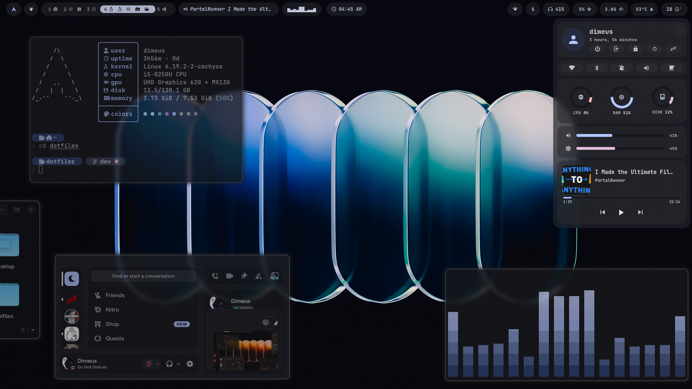
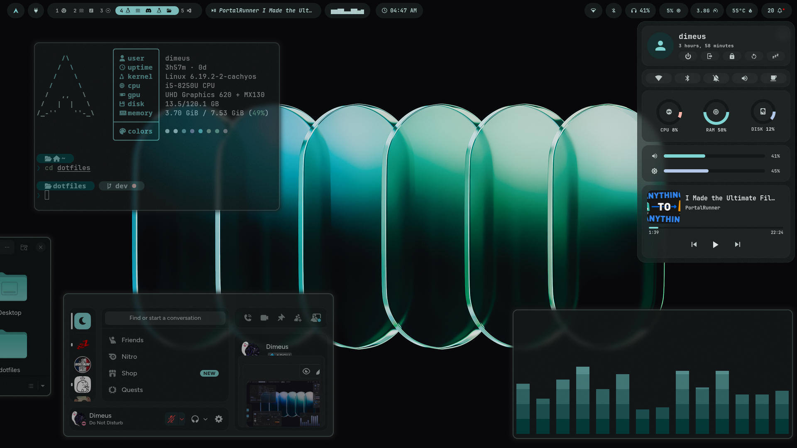
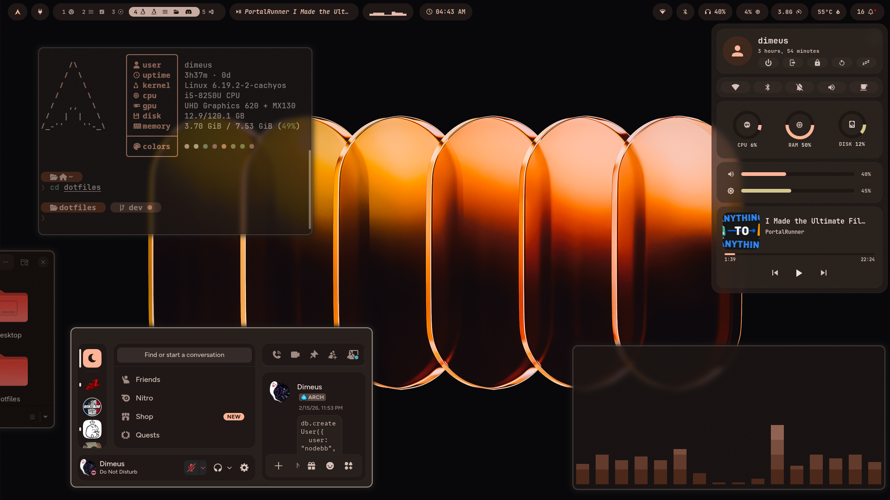
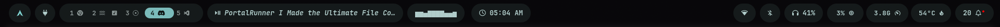
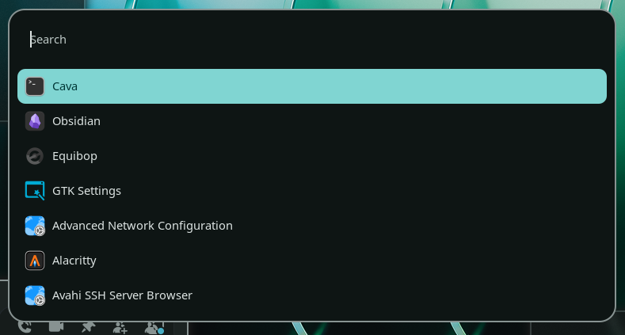
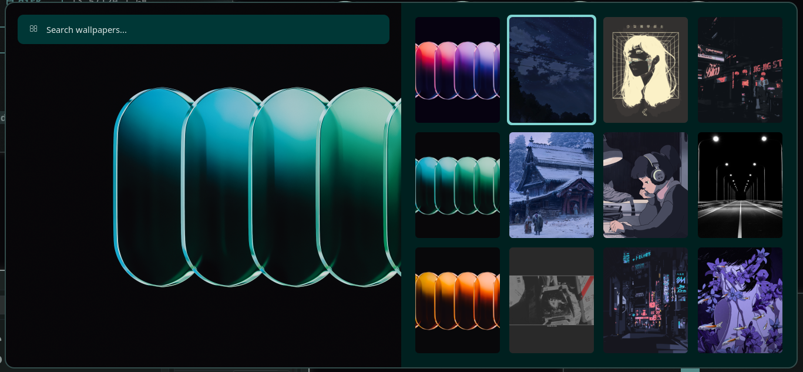
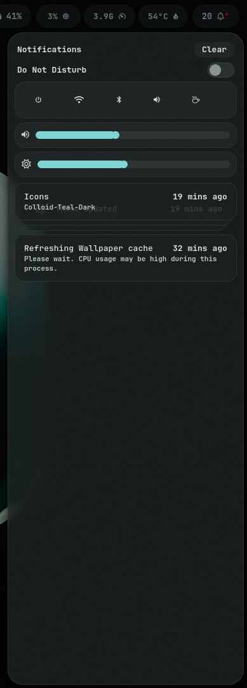
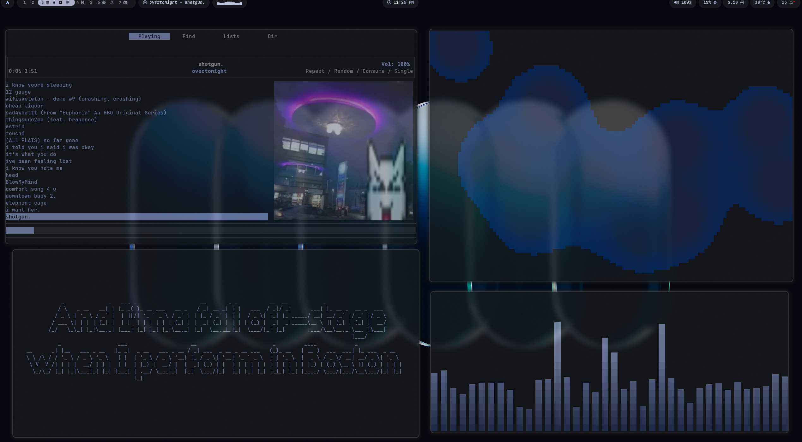

# Dimeus Dotfiles

**Clean Hyprland dotfiles for Arch Linux**

---

## Contents

- **Hyprland** - Wayland compositor configuration
- **Waybar** - Status bar
- **Rofi** - Application launcher and menus
- **Matugen** - Dynamic theming from wallpapers
- **Kitty** - Terminal emulator
- **Neovim** - Text editor
- **Zsh + Oh my Zsh** - Shell configuration
- **170+ Wallpapers** - Hand picked [wallpapers](https://github.com/DimeusDev/wallpapers)

---

## Showcase Video (click on the thumbnail)
[](https://www.youtube.com/watch?v=xtT5bgM6kXA)

---

<details>
<summary><strong>Screenshots</strong></summary>

<br>











</details>

---

## How to use the dotfiles

**Prerequisites:**
- Arch Linux or Arch-based distribution like CachyOS
- Hyprland already installed

**Installation:**

```bash
git clone https://github.com/DimeusDev/dotfiles.git ~/dotfiles
cd ~/dotfiles/install
./install.sh
```

The installer will ask you questions, install packages, and deploy the dotfiles.

### Essential Keybindings

| Key | Action |
|-----|--------|
| `Ctrl + Shift + Space` | Show Keybindings (USE THAT TO SEARCH BINDS) |
| `Super + B` | Color Picker |
| `Super + Ctrl + V` | Nerdfont icons selector |
| `Super + V` | Clipboard History |
| `Super + Semicolon` | Terminal |
| `Super + N` | Browser |
| `Super + E` | File Manager |
| `Super + M` | Text Editor |
| `Alt + Space` | App Launcher |
| `Ctrl + Space` | Wallpaper Selector |
| `Alt + F4` | Power Menu |
| `Super + ESC` | Rofi Power Menu |
| `Super + L` | Lock Screen |
| `Super + Q` | Close Window |


---


## License

MIT License

---
> This dotfiles is not 100% my creation obviously, i used scripts and config from other dotfiles such as [Dusky](https://github.com/dusklinux/dusky) and more..

**Discord: _dimeus**

